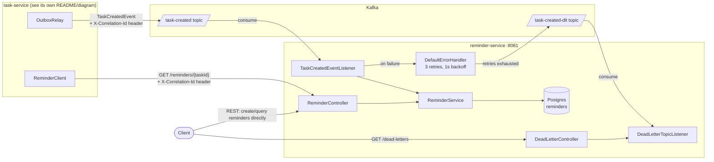

# reminder-service

Owns reminders: creating them and answering queries about them, either
asynchronously — when it consumes a `TaskCreated` Kafka event — or
synchronously, when called directly over its own REST API. It is one half
of a two-service system — the other half, task-service, owns tasks.

Together, task-service and reminder-service demonstrate:

- **Microservice boundaries** — tasks and reminders are owned, deployed,
  and scaled independently, each with its own database and API.
- **Resilient inter-service communication** — task-service's synchronous
  calls into this service (fetching reminders for a task) are protected
  on the caller's side by a circuit breaker, retry, timeout, and
  fallback.
- **Event-driven design** — this service does not need task-service to be
  up, fast, or reachable in order to eventually create a reminder; it
  consumes events off Kafka at its own pace, and a record that fails
  processing is retried and, if it keeps failing, moved to a dead-letter
  topic rather than lost.

## Architecture



**Async path — the normal way a reminder gets created.**
`TaskCreatedEventListener` consumes the `task-created` topic and calls
`ReminderService.createReminder` for each event. This is why the REST
`POST /reminders` endpoint below still exists but is not how
task-service triggers reminder creation: that path runs independently of
whether any particular request to task-service succeeds or how quickly
this service processes the resulting event.

**Sync path — fully supported standalone.** The REST API works on its
own, useful for testing, admin tooling, or any caller that is not
event-driven. task-service itself only uses `GET /reminders/{taskId}`
(via its own `ReminderClient`, wrapped in Resilience4j on task-service's
side) to look up reminders for a task on demand.

**Failure handling.** A record that throws while being processed is
retried by a `DefaultErrorHandler` (3 attempts, 1 second apart). If it
keeps failing, `DeadLetterPublishingRecoverer` publishes it to
`task-created-dlt` with diagnostic headers (original topic, exception
class and message) rather than dropping it. `DeadLetterTopicListener`
logs each dead-lettered record and keeps the most recent 50 in memory,
exposed via `GET /dead-letters` for inspection — a lightweight aid, not a
durable store or a replay mechanism.

## Persistence

Postgres via Spring Data JPA, with Flyway owning the schema
(`src/main/resources/db/migration`); `spring.jpa.hibernate.ddl-auto` is
set to `validate`, so Hibernate only checks the schema matches the
`Reminder` entity at startup rather than generating DDL itself.

## Correlation IDs & logging

A servlet filter picks up `X-Correlation-Id` from incoming REST requests,
generating one as a fallback for direct calls with no header. The Kafka
listener does the equivalent for the async path: it reads the
correlation id off the `task-created` record's headers, so a reminder
created purely from an event can still be traced back to the
task-service request that originally triggered it. Logs are structured
JSON (`logstash-logback-encoder`) with `correlationId` as a field.

## Endpoints

| Method | Path                     | Description                                    |
|--------|--------------------------|-------------------------------------------------|
| POST   | `/reminders`             | Create a reminder directly (bypasses Kafka)     |
| GET    | `/reminders`             | List all reminders                              |
| GET    | `/reminders/{taskId}`    | Get reminders for a task                        |
| GET    | `/reminders/id/{reminderId}` | Get a single reminder by id                |
| GET    | `/dead-letters`          | List the most recent dead-lettered records (in-memory, last 50) |
| GET    | `/actuator/health`, `/actuator/metrics`, `/actuator/prometheus` | Actuator |
| GET    | `/swagger-ui.html`       | Interactive API docs                            |

## Running locally

### With docker-compose (task-service + reminder-service + Kafka + Postgres)

The compose file lives in task-service's repo and expects this repo
checked out as a sibling directory (`../reminder-service` relative to
task-service). From the task-service directory:

```bash
docker-compose up --build
```

Brings up Kafka, a dedicated Postgres per service, and both applications.

### Standalone

Requires a reachable Postgres, since Flyway runs its migrations against
`spring.datasource.url` at startup:

```bash
DB_HOST=localhost DB_PORT=5434 DB_NAME=reminders DB_USERNAME=reminder DB_PASSWORD=reminder \
  mvn spring-boot:run
```

If Kafka is not running, the `@KafkaListener` logs connection warnings on
a background thread and keeps retrying — it does not block startup or
the REST API.

## Tests

`mvn verify` runs both unit tests (`*Test`, via `maven-surefire-plugin`)
and integration tests (`*IT`, via `maven-failsafe-plugin`). The `*IT`
tests use [Testcontainers](https://testcontainers.com) to run against a
real Postgres and require Docker; `mvn test` alone needs no Docker and
covers everything else.

- **Unit tests** — service/controller logic, correlation-id filter,
  `TaskCreatedEventListener`'s event-to-reminder mapping and
  correlation-id extraction, and `DeadLetterTopicListener`'s
  header-parsing and bounded in-memory storage — all tested directly,
  with no broker.
- **`ReminderRepositoryIT`** — a real Postgres (Testcontainers) with the
  `@DataJpaTest` slice's Flyway migration applied, exercising the actual
  repository queries.
- **`TaskCreatedEventConsumerIT`** — publishes a real `TaskCreatedEvent`
  to an embedded Kafka broker and asserts a `Reminder` row is actually
  persisted by the real listener, service, and repository.
- **`DeadLetterHandlingIT`** — forces `ReminderService` to always throw
  (the one piece mocked in this test) and asserts the record is retried,
  then dead-lettered, then picked up by the real
  `DeadLetterTopicListener` — proving the whole failure path end to end.
- **`ApplicationIT`** — full Spring context against a real Postgres, plus
  a health check and an empty-list smoke test.

## A cross-service wire-format detail worth calling out

task-service and reminder-service each keep their own copy of
`TaskCreatedEvent` (different packages, different repositories),
deliberately. The Kafka message carries no Java type header
(`spring.json.add.type.headers: false` on the producer); the consumer
instead deserializes straight into its own class via
`spring.json.value.default.type`. Two services in separate repositories
should never need to share a Java class to talk over Kafka — only the
JSON shape is a contract between them.
