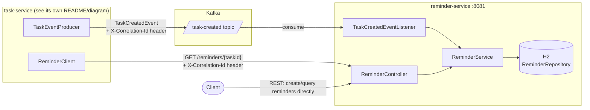

# reminder-service

Owns reminders. It's one half of a two-service system — the other half,
[task-service](../task-service), owns tasks — and creates a reminder either
asynchronously (when it consumes a `TaskCreated` Kafka event) or
synchronously (when called directly over its own REST API).

This project (together with task-service) is a portfolio piece
demonstrating:

- **Microservice boundaries** — tasks and reminders are owned, deployed, and
  scaled independently, each with its own data store and API.
- **Resilient inter-service communication** — task-service's synchronous
  calls into this service (fetching reminders for a task) are protected on
  the caller's side by a circuit breaker, retry, timeout, and fallback.
- **Event-driven design** — this service doesn't need task-service to be
  up, fast, or even reachable to eventually create a reminder: it just
  consumes events off Kafka at its own pace.

## Architecture



**Async path (the normal way a reminder gets created):**
`TaskCreatedEventListener` consumes the `task-created` topic and calls
`ReminderService.createReminder` for each event. This is why the REST
`POST /reminders` endpoint below still exists but is no longer how
task-service creates reminders — it moved off that synchronous call
entirely so that task creation never blocks on this service.

**Sync path (still fully supported):** the REST API works standalone —
useful for testing, admin tooling, or any other caller that isn't
event-driven. task-service itself only uses `GET /reminders/{taskId}` (via
its own `ReminderClient`, wrapped in Resilience4j on task-service's side)
to look up reminders for a task on demand.

## Correlation IDs & logging

A servlet filter picks up `X-Correlation-Id` from incoming REST requests
(generating one as a fallback for direct calls with no header). The Kafka
listener does the equivalent for the async path: it reads the correlation
id off the `task-created` record's headers, so a reminder created purely
from an event can still be traced back to the task-service request that
originally triggered it. Logs are structured JSON
(`logstash-logback-encoder`) with `correlationId` as a field.

## Endpoints

| Method | Path                     | Description                                    |
|--------|--------------------------|-------------------------------------------------|
| POST   | `/reminders`             | Create a reminder directly (bypasses Kafka)     |
| GET    | `/reminders`             | List all reminders                              |
| GET    | `/reminders/{taskId}`    | Get reminders for a task                        |
| GET    | `/reminders/id/{reminderId}` | Get a single reminder by id                |
| GET    | `/actuator/health`, `/actuator/metrics`, `/actuator/prometheus` | Actuator |
| GET    | `/swagger-ui.html`       | Interactive API docs                            |

## Running locally

### With docker-compose (task-service + reminder-service + Kafka)

The compose file lives in **task-service's** repo and expects this repo
checked out as a **sibling directory** (`../reminder-service` relative to
task-service). From the task-service directory:

```bash
docker-compose up --build
```

### Standalone

```bash
mvn spring-boot:run
```

Persistence is H2 in-memory either way (`spring.h2.console.enabled=true` if
you want to poke at it while running). If Kafka isn't running, the
`@KafkaListener` just logs connection warnings on a background thread and
keeps retrying — it doesn't block startup or the REST API.

## Tests

`mvn verify` runs both unit tests (`*Test`) and integration tests
(`*IT`, via `maven-failsafe-plugin`):

- **Unit tests** — service/controller logic, correlation-id filter,
  `TaskCreatedEventListener`'s event-to-reminder mapping and its
  correlation-id extraction, tested directly without a broker.
- **`TaskCreatedEventConsumerIT`** — publishes a real `TaskCreatedEvent` to
  an embedded Kafka broker (`@EmbeddedKafka`) and asserts a `Reminder` row
  actually gets persisted by the real listener + service + repository.
- **`ApplicationIT`** — full Spring context + health check + empty-list
  smoke test.

## A cross-service wire-format detail worth calling out

task-service and reminder-service each keep their **own** copy of
`TaskCreatedEvent` (different packages, different repos) — deliberately.
The Kafka message carries no Java type header (`spring.json.add.type.headers:
false` on the producer); the consumer instead deserializes straight into
its own class via `spring.json.value.default.type`. Two services in
separate repos should never need to share a Java class to talk over Kafka.

## Known limitations / future improvements

- Persistence is H2 in-memory (unchanged from before this work) — data is
  lost on restart, in every environment including docker-compose. A real
  database (e.g. Postgres) is a reasonable next step but out of scope here.
- No outbox/dead-letter handling beyond the consumer's built-in retry
  (`DefaultErrorHandler`, 3 attempts / 1s backoff) — a record that keeps
  failing is logged and skipped, not parked anywhere for later inspection.
